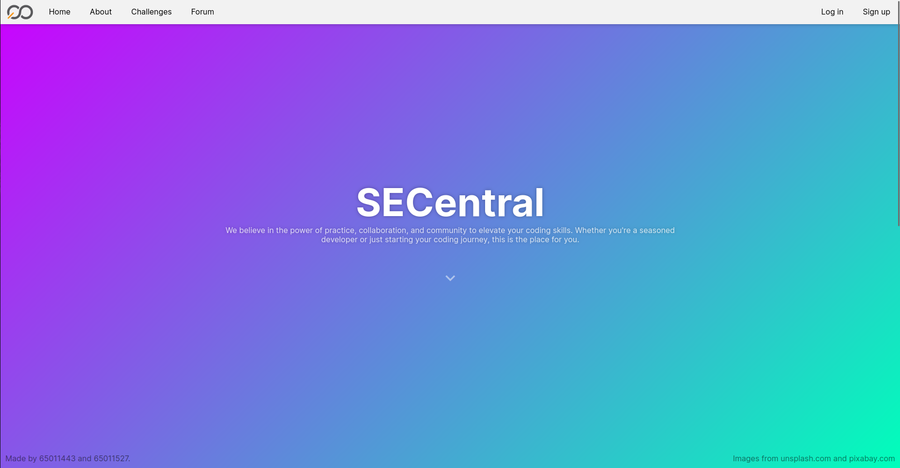
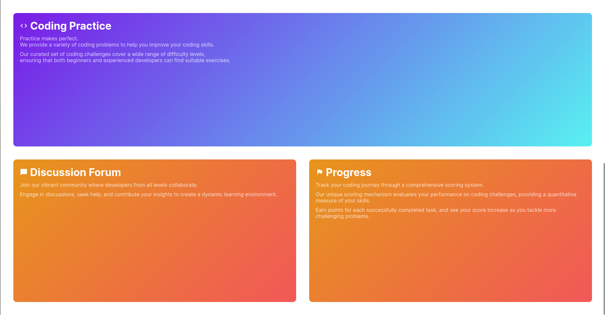
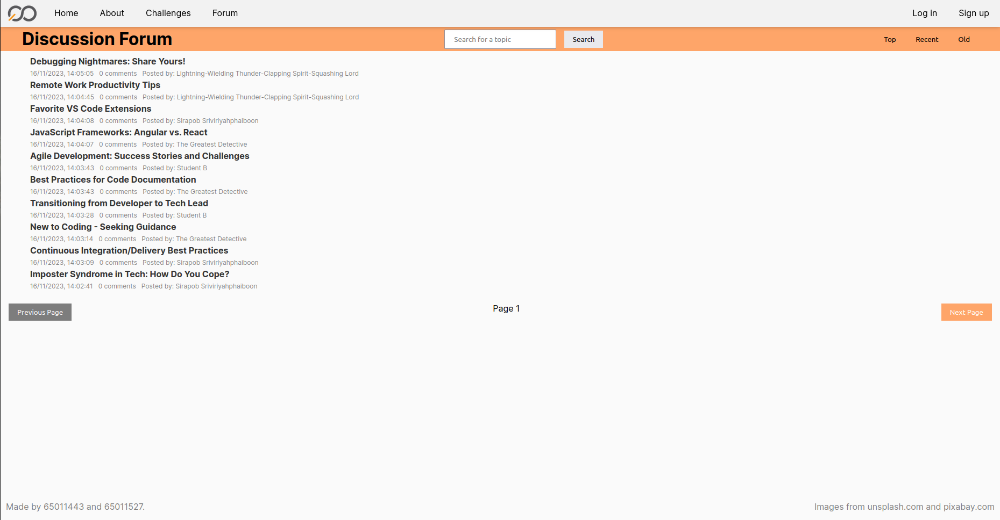
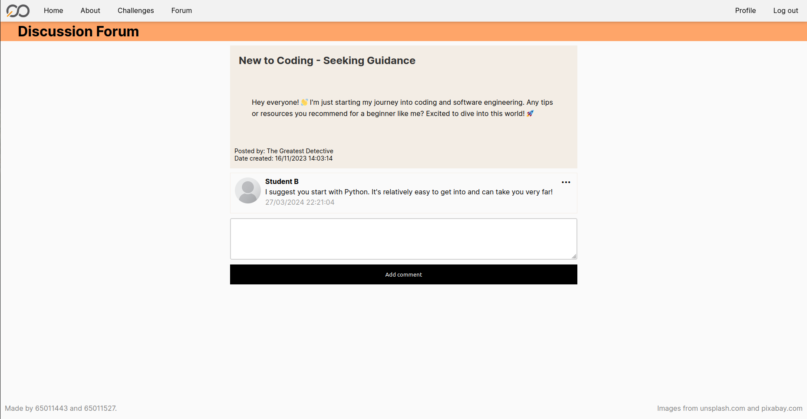
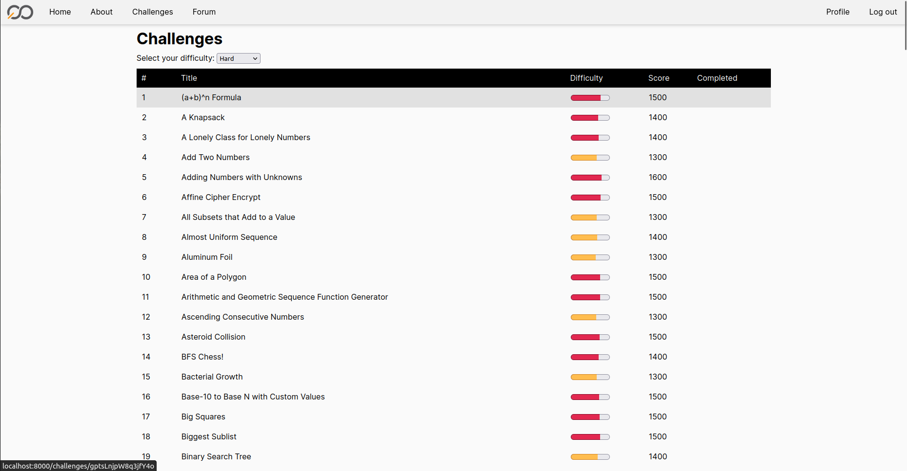
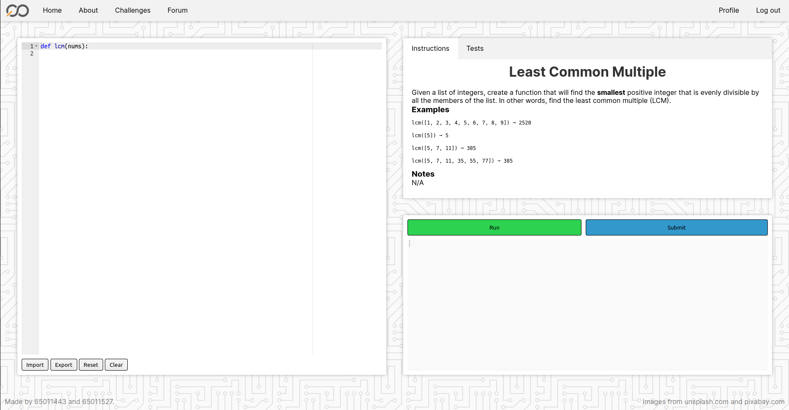
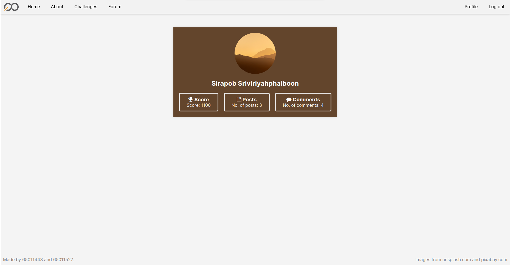

# SE Central

KMITL Web Programming Project

## Introduction

SE Central is a web application to provide students and teachers alike with a variety of features through a pleasing UX/UI design.

## Features
- Discussion forum
  - Create posts
  - Edit and delete comments
  - Search for posts
- Programming Challenges
  - Varying levels of difficulty
  - Python interpreter
  - Import and export challenge files
  - Earn points
- Profile
  - Change profile picture
  - Change background color
  - View earned points

## Installation
```python3 -m pip install -r requirements.txt```

Note: Pyston library only works up to Python 3.10.X

## Usage
```uvicorn app:app --host 0.0.0.0 --port 80```

## Demo








## License
This project is licensed under the terms of the MIT license.
